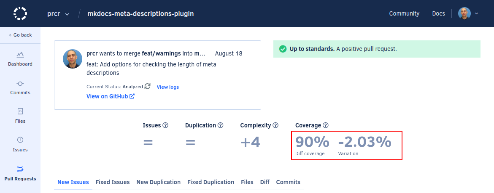

# Codacy Coverage Reporter GitHub Action

[](https://www.codacy.com/gh/codacy/codacy-coverage-reporter-action/dashboard?utm_source=github.com&amp;utm_medium=referral&amp;utm_content=codacy/codacy-coverage-reporter-action&amp;utm_campaign=Badge_Grade)

This GitHub Action [uploads coverage reports to Codacy](https://docs.codacy.com/coverage-reporter/#uploading-coverage) on all commits and pull requests, letting you track code coverage on the Codacy UI. After setting it up, you can optionally [enable status checks on pull requests](https://docs.codacy.com/repositories-configure/integrations/github-integration/#status-checks) to avoid adding untested code or decreasing coverage.



[Codacy](https://www.codacy.com/) is an automated code review tool that makes it easy to ensure your team is writing high-quality code by analyzing more than 40 programming languages such as PHP, JavaScript, Python, Java, and Ruby. Codacy allows you to define your own quality rules, code patterns and quality settings you'd like to enforce to prevent issues on your codebase.

[Learn more about Codacy Coverage](https://blog.codacy.com/introducing-codacy-coverage)  
[Why do you need to measure code coverage?](https://blog.codacy.com/why-do-you-need-to-measure-code-coverage)

<br/>

<a href="https://www.codacy.com" target="_blank"></a>

<br/>

## Uploading coverage to Codacy

Before setting up Codacy Coverage Reporter GitHub Action you must have tests and use tools to [generate coverage reports](https://docs.codacy.com/coverage-reporter/#generating-coverage) for the source code files in your repository.

To upload coverage to Codacy using the GitHub Action using default settings:

1.  Set up an API token to allow the GitHub Action to authenticate on Codacy:

    -   **If you're setting up one repository**, [obtain a project API token](https://docs.codacy.com/codacy-api/api-tokens/#project-api-tokens) and store it as an [encrypted secret for your **repository**](https://docs.github.com/actions/reference/encrypted-secrets#creating-encrypted-secrets-for-a-repository) with the name `CODACY_PROJECT_TOKEN`.
    -   **If you're setting up multiple repositories**, [obtain an account API token](https://docs.codacy.com/codacy-api/api-tokens/#account-api-tokens) and store it as an [encrypted secret for your **organization**](https://docs.github.com/en/actions/reference/encrypted-secrets#creating-encrypted-secrets-for-an-organization) with the name `CODACY_API_TOKEN`.

    > ⚠️ **Never write API tokens to your configuration files** and keep your API tokens well protected, as they grant owner permissions to your projects on Codacy.

2.  [Generate a supported code coverage report](https://docs.codacy.com/coverage-reporter/#generating-coverage) on each push to your repository.

3.  Add the following to a file `.github/workflows/codacy-coverage-reporter.yaml` in your repository, where `PATH_TO_REPORT` is the path to the coverage report:

    ```yaml
    name: Codacy Coverage Reporter

    on: ["push"]

    jobs:
      codacy-coverage-reporter:
        runs-on: ubuntu-latest
        name: codacy-coverage-reporter
        steps:
          - uses: actions/checkout@v2
          - name: Run codacy-coverage-reporter
            uses: codacy/codacy-coverage-reporter-action@v1.3.0
            with:
              project-token: ${{ secrets.CODACY_PROJECT_TOKEN }}
              # or
              # api-token: ${{ secrets.CODACY_API_TOKEN }}
              coverage-reports: <PATH_TO_REPORT>
              # or a comma-separated list for multiple reports
              # coverage-reports: <PATH_TO_REPORT>, <PATH_TO_REPORT>
    ```

4.  Optionally, to add coverage results to GitHub status checks, [configure a quality gate for coverage](https://docs.codacy.com/repositories-configure/integrations/github-integration/#status-checks) and [enable sending status checks](https://docs.codacy.com/repositories-configure/integrations/github-integration/#status-checks) on Codacy.

## Parameters

The Codacy GitHub Action is a wrapper for running the [Codacy Coverage Reporter CLI](https://github.com/codacy/codacy-coverage-reporter#codacy-coverage-reporter) and supports the following subset of parameters available for the command `report`:

| Parameter               | Description                                                                                                                                                     | Recommended value                     |
|-------------------------|-----------------------------------------------------------------------------------------------------------------------------------------------------------------|---------------------------------------|
| `project-token`         | [Project API token](https://docs.codacy.com/codacy-api/api-tokens/#project-api-tokens)                                                                          | `${{ secrets.CODACY_PROJECT_TOKEN }}` |
| `api-token`             | [Account API token](https://docs.codacy.com/codacy-api/api-tokens/#account-api-tokens), an alternative to `project-token` when setting up multiple repositories | `${{ secrets.CODACY_API_TOKEN }}`     |
| `coverage-reports`      | Optional path or glob pattern to the coverage report relative to the repository root, or a comma-separated list for multiple reports                                            | `''`                                  |
| `language`              | Optionally associate a language with your coverage report(s)                                                                                                    | `''`                                  |
| `force-coverage-parser` | Optionally force using a specific coverage report parser                                                                                                        | `''`                                  |
| `coverage-reporter-version` | Optionally force using a specific coverage reporter version                                                                                                 | `''`       
